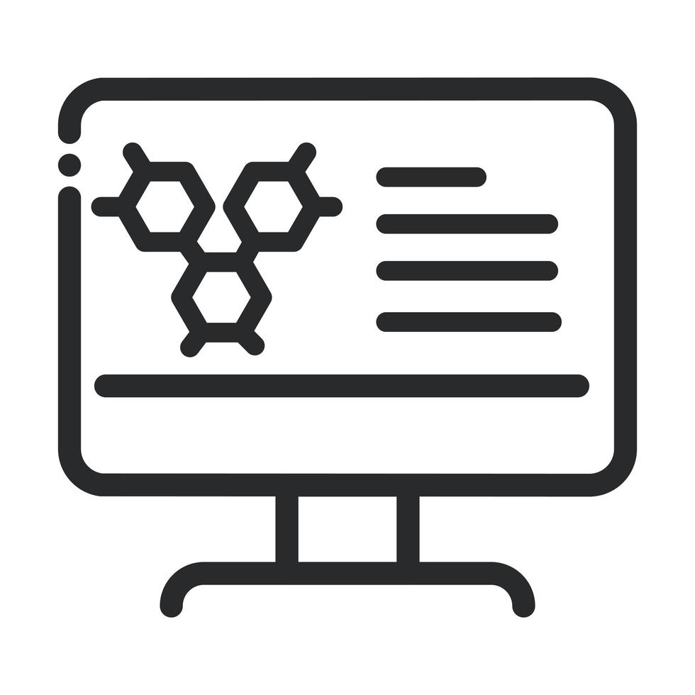
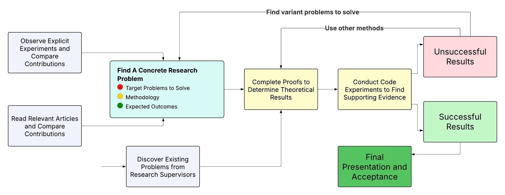

[![Publications][pub-shield]][pub-url]
[![Projects][proj-shield]][proj-url]
[![Applied AI Methods][aai-shield]][aai-url]
[![Ongoing Research Projects][ongp-shield]][ongp-url]
[![All Programs Pass Tests][appt-shield]][appt-url]
[![All Programs Contains Documentations][aacd-shield]][aacd-url]
[![Each Project Submit A Publication][epsp-shield]][epsp-url]
[![Actively Updating][au-shield]][au-url]

<!-- PROJECT LOGO -->
<table border="0" cellspacing="0" cellpadding="0">
  <tr>
    <td style="vertical-align: middle;">
      
    </td>
    <td style="vertical-align: middle; padding-left: 15px;">
      <h3 style="margin: 0;">Official Research Project Series (with Publications available)</h3>
    </td>
  </tr>
</table>

  This project series contains all necessary components of Jingze's official research contributions (starting from January 2024), including source code, pseudocode, experimental results, documentation, and mathematical proofs. Each repository includes an independent project, finally leading to publication on IEEE or research conferences. 

[![Python][python-shield]][python-url]
[![Latex][latex-shield]][latex-url]

[![Pandas][pandas-shield]][pandas-url]
[![Scikit-learn][scil-shield]][scil-url]
[![NumPy][numpy-shield]][numpy-url]
[![SciPy][scipy-shield]][scipy-url]
[![TensorFlow][ten-shield]][ten-url]

<!-- TABLE OF CONTENTS -->

  
Table of Contents

  <ol>
    <li><a href="#about-the-project">About The Project</a></li>
    <li><a href="#contact">Contact</a></li>
    <li><a href="#folder-structures-and-file-contents">Folder Structures and File Contents</a></li>
  </ol>

<!-- ABOUT THE PROJECT -->
<h2 id="about-the-project">
  
  About The Project
</h2>

Starting January 2024, Jingze began research contributions by joining research group projects, with formal publications. This repository stores all content files of a research project.

The diagram below shows all mandatory processes of research projects:

Each project has a publication at a conference or an academic journal, and each repository's `README.md` provides its link.

  

<h2 id="contact">
  
  Contact
</h2>

**Personal Email Address** - david1147062956@gmail.com

Research Email Address - dai.jingze@icloud.com

Personal Portfolio - [https://sites.google.com/view/jingzedaiinfo/personal-info](https://sites.google.com/view/jingzedaiinfo/personal-info)

  

<h2 id="folder-structures-and-file-contents">
   
  Folder Structures and File Contents
</h2>

**{...}** 
  - An independent research project. (Every repository is)

README.md
  - This file

  

[pub-shield]: https://img.shields.io/badge/Publications-3-blue
[pub-url]: https://scholar.google.com/citations?hl=en&user=o9k4mBkAAAAJ
[proj-shield]: https://img.shields.io/badge/Research_Projects-3-green
[proj-url]: https://github.com/daijingz/Research_Projects
[aai-shield]: https://img.shields.io/badge/Applied_AI_Methods->22-cyan
[aai-url]: https://www.datacamp.com/
[ongp-shield]: https://img.shields.io/badge/Ongoing_Research_Projects-2-yellow
[ongp-url]: https://scholar.google.com/citations?hl=en&user=o9k4mBkAAAAJ
[appt-shield]: https://img.shields.io/badge/All_Programs_Verified_By_Tests-purple
[appt-url]: https://github.com/daijingz/Research_Projects
[aacd-shield]: https://img.shields.io/badge/All_Programs_Contain_Documentations-orange
[aacd-url]: https://github.com/daijingz/Research_Projects
[epsp-shield]: https://img.shields.io/badge/Each_Project_Submit_A_Publication-lightgreen
[epsp-url]: https://github.com/daijingz/Research_Projects
[au-shield]: https://img.shields.io/badge/Actively_Updating-darkred
[au-url]: https://www.linkedin.com/in/jingze-dai/

[python-shield]: https://img.shields.io/badge/Python-blue
[python-url]: https://www.python.org/
[latex-shield]: https://img.shields.io/badge/LaTeX-darkgreen
[latex-url]: https://www.latex-project.org/

[pandas-shield]: https://img.shields.io/badge/Pandas-darkblue
[pandas-url]: https://pandas.pydata.org/
[scil-shield]: https://img.shields.io/badge/Scikitlearn-orange
[scil-url]: https://scikit-learn.org/stable/
[numpy-shield]: https://img.shields.io/badge/NumPy-skyblue
[numpy-url]: https://numpy.org/
[scipy-shield]: https://img.shields.io/badge/SciPy-cyan
[scipy-url]: https://scipy.org/
[ten-shield]: https://img.shields.io/badge/TensorFlow-yellow
[ten-url]: https://www.tensorflow.org/
